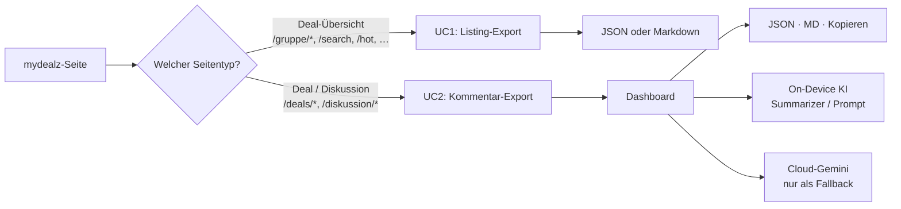

# MyDealz AI Exporter

Eine Chrome-Extension (Manifest V3, Vanilla JS) für [mydealz.de](https://www.mydealz.de): exportiert Deals und komplette Kommentar-Threads strukturiert als JSON oder Markdown — und analysiert sie optional mit KI, komplett on-device.

**Kein Backend, keine Cloud-Pflicht, kein Framework.** Alles läuft lokal in deinem eingeloggten Browser.

---

## Die zwei Use-Cases

Die Extension ist bewusst auf genau zwei Produkte eingefroren (siehe `review_grok.md` §11):



### Use-Case 1 — Deal-Übersichten

Auf jeder Übersichtsseite (`/gruppe/iphone-17`, `/search?q=…`, `/hot`, `/neu`, …) erscheint ein Widget unten rechts:

- **JSON** — alle sichtbaren Deals mit vollem Feldset: Titel, Beschreibung (Plaintext + HTML), Preise inkl. `displayPrice`, durchgestrichener UVP und berechneter Rabatt-%, Versandkosten (`shipping`, `shippingFree`), Temperatur, Kommentarzahl, Händler, Autor, Bearbeitungs-Zeitstempel (`updatedAt`), **Kategorie** (`mainGroup`/`groupsPath`), Ablaufstatus, Bild-URL, `shareLink` und alle Links der Beschreibung (`links[]`)
- **MD** — dieselben Daten als kompakte Markdown-Deal-Karten mit echten Überschriften, Fett-Durchstreichungen und Markdown-Beschreibungen
- **+2 Seiten** — lädt zusätzlich die zwei Folgeseiten (via `?page=N&ajax=true&layout=horizontal`, geparst aus den `data-vue3`-Payloads), dedupliziert gegen die sichtbare Seite. Bewusst knapp gedeckelt: max. 2 Extraseiten, 700 ms Pause — kein Ban-Risiko

### Use-Case 2 — Deal-/Diskussionsseiten

Auf `/deals/*`, `/gutscheine/*`, `/diskussion/*` sitzt ein Zwei-Button-Widget unten rechts:

| Button | Funktion |
|---|---|
| 🧠 **Export & Analyse** | Holt **alle** Kommentare über GraphQL — inklusive aller Replies hinter den „Mehr Antworten anzeigen"-Buttons — und öffnet das Dashboard. Seitenunabhängig: egal ob du auf Seite 1 oder 7 stehst, der Export holt den kompletten Thread |
| 💬 **Antworten ausklappen** | Status-Anzeige + Manuell-Trigger. Klappt alle versteckten Antworten per natives Klicken aus (`data-t="moreReplies"`), damit Strg+F den ganzen Thread durchsucht. Läuft auch automatisch |

**Der Kommentar-Ping beim Seitenladen:** Der Export-Button fragt beim Laden einen einzigen Mini-GraphQL-Ping (nur Pagination) und zeigt sofort die Thread-Größe — z. B. „110 Komm. · 2 Seiten" — damit du abschätzen kannst, wie lange der Export dauert.

**Automatisches Ausklappen:** Sobald Kommentare geladen sind, werden alle versteckten Antworten automatisch ausgeklappt (auch auf nachgeladenen Seiten) — terminierend, mit Request-Pausen, ohne Endlosschleife.

---

## Das Dashboard

Nach dem Export öffnet sich ein Tab mit:

- **Meta-Karte** — Titel, Preis, Händler, Temperatur, Autor, Beschreibung, Klick auf das Original
- **Statistik-Kacheln** — Top-Level-Kommentare, Replies, verborgene Replies, Reaktionen (👍 / 💡 / 😄, inklusive Replies) — als Klickfilter
- **Kommentarliste** — mit Reply-Baum, Score-System (`helpful×3 + replies×3 + like×2 + funny`), 🔥-Badges für Hot-Kommentare, 🗑 für moderierte Löschungen, 👑 **OP-Badge** für den Thread-Autor und ↗-Permalink (`#comment-…` / `#reply-…`) zu jedem einzelnen Kommentar auf mydealz
- **🔗 Links-Tab** — komplette Linkliste der Konversation: alle in Kommentaren und der Beschreibung gedroppten URLs, dedupliziert, `/visit/`-Redirects werden aufgelöst, wenn die echte Ziel-URL im `title`-Attribut steckt
- **Volltextsuche** — filtert nach Text oder Autor, auch in den Replies, kombinierbar mit Tabs und Sortierung
- **Export** — JSON, Markdown (inkl. 🔗-Linkliste) und Clipboard

### KI-Analyse

Sechs feste Prompts (Zusammenfassung, Stimmung, offene Fragen, beste Kommentare, Probleme, Kauf-Verdict) plus eigene Fragen. Fallback-Kette:

```text
Chrome On-Device AI (window.ai)  →  Gemini API-Key aus dem Popup  →  klare Fehlermeldung
```

Bei Threads mit mehr als 250 relevanten Kommentaren läuft automatisch **Map-Reduce**: Batches à 40 werden einzeln zusammengefasst, die Zusammenfassungen bilden den Kontext für die finale Analyse — statt 20k Zeichen Rohmüll in ein Modell zu stopfen.

---

## Installation

1. `chrome://extensions` öffnen
2. **Entwicklermodus** aktivieren
3. **Entpackte Erweiterung laden** → Repo-Wurzel wählen (dort liegt die `manifest.json`)
4. Nach Code-Änderungen: Extension-Karte reloaden + mydealz-Tab neu laden

Voraussetzung: bei mydealz **eingeloggt** (die GraphQL-Endpunkte brauchen CSRF-Token + Session-Cookie).

---

## Architektur

```text
content/link-share.js   Geteilte Link-Extraktion (UC1 + UC2)
content/listing.js      UC1: Listing-Widget, GQL-Chunking, AJAX-Pagination, MD-Generator
content/content.js      UC2: GQL-Kommentar-Walker, Widget (Export + Ausklappen), Meta-Extraktion
background/service_worker.js   RAM-Transfer zum Dashboard-Tab
popup/                  Gemini-API-Key-UI
ui/dashboard.html/js    Analyse, Filter, Suche, KI, Downloads
```

### Der GraphQL-Walker (UC2)

Der wertvolle Kern — Kommentare werden nicht aus dem DOM geschabt, sondern direkt von `/graphql` geholt:

```graphql
query($filter: CommentFilter!, $limit: Int, $page: Int) {
  comments(filter: $filter, limit: $limit, page: $page) {
    items { commentId preparedHtmlContent reactionCounts { type count } … }
    pagination { count last }
  }
}
```

- **Top-Level** paginiert (100/Seite), Sortierung aufsteigend
- **Replies** über den `mainCommentId` + `threadId` Composite-Key — mydealz-Absonderheit: ohne `threadId` liefert der Endpunkt still nichts (dokumentiert in `data_insights.md`)
- **30er-Alias-Batches** für fehlende Replies, mit Höflichkeitspausen
- `repliesPreview` wird ausgenutzt: die meisten Unterhaltungen stecken schon im Root-Objekt

### Robustheit

- **Retry/Backoff** nur bei transienten Fehlern (408/429/5xx, Netzwerk), 403/404 werfen sofort; `Retry-After`-Header schlagen das Eigen-Backoff
- **Rate-Limit-Disziplin** überall: 300–700 ms Pausen, gedeckelte Extraseiten, pausierte Reply-Batches
- **CSRF** aus Meta-Tag mit `xsrf_t`-Cookie-Fallback (inkl. Unquoting)
- Fehlermeldungen im Button-Label sind verständlich: „Rate-Limit (429)", „Kein XSRF-Token", „Netzwerk-Timeout" — keine stillen Fehler

### Datenquellen statt CSS-Geräte

Die Extension liest mydealz' strukturierte Datenlayer, nicht styling-abhängige Klassen:

| Quelle | Genutzt für |
|---|---|
| GraphQL `/graphql` | Kommentare, Replies, Thread-Felder (UC2 + UC1-Enrichment) |
| `data-vue3`-Payloads | Thread-IDs + outbound deal-Link/Händler-Domain auf Listings, AJAX-Folgeseiten |
| `data-t`-Attribute | Metadaten-Selektoren, Ausklapp-Buttons — mydealz' eigene stabile Hook-Schicht |
| Portale (`#threadDescriptionItemPortal`, …) | Beschreibung, Zusatzinfos |

---

## Datenschutz

- Alle Daten bleiben auf deinem Gerät: Export-Payload läuft über den Service Worker ins Dashboard, keine Server-Kommunikation außer zu mydealz selbst
- Cloud-Gemini ist **opt-in** und nur Fallback — der API-Key liegt in `chrome.storage.local`
- Die Extension sammelt nichts, trackt nichts, hat keine externen Hosts außer `generativelanguage.googleapis.com` (nur für den Fallback-Pfad)

---

## Bekannte Grenzen

- **Verborgene Replies:** Sehr tiefe Reply-Bäume kann die API deckeln (`_hiddenReplies`-Feld zeigt die Anzahl transparent im Dashboard)
- **Rate-Limit bei HTTP 200 + HTML:** mydealz liefert bei Drosselung gelegentlich HTML statt JSON — wird aktuell als kryptischer Fehler geworfen (bekanntes Ticket, siehe `data_insights.md`)
- **KI on-device:** `window.ai` ist Chrome-Preview — Verfügbarkeit hängt von Version/Hardware ab, der Cloud-Fallback fängt es auf
- **Gutscheine/Diskussionen:** Preis-/Händler-Felder sind dort naturgemäß `null`

---

## Projekt-Dokumentation

- `data_insights.md` — GraphQL-Eigenheiten, Datenquellen-Erkenntnisse, alle übernommenen Techniken aus Community-Quellen
- `review_grok.md` — Zielarchitektur, Use-Case-Grenzen, Review-Gegenprüfung
- `AI-AGENTS-CLI.md` — Entwickler-Workflow (Extension laden, DevTools-MCP, Systemprompt)

## Inspiration & Credits

Techniken und Ideen aus der mydealz-Community (alles detailliert in `data_insights.md` referenziert):

- **[Sammlung: Starten statt warten](https://www.mydealz.de/diskussion/sammlung-mydealz-auch-ohne-app-nutzen-2035404)** — die zentrale mydealz-Tooling-Sammlung; [Zusätzliche Info 103930](https://www.mydealz.de/diskussion/sammlung-mydealz-auch-ohne-app-nutzen-2035404#additionalInfo-103930) enthält den kategorisierten Tool-Index aller Skripte, Bookmarklets und Erweiterungen
- **[MD928835](https://greasyfork.org/de/users/1419623-md928835)** (a.k.a. „Anonymer Benutzer", Thread-Gründer der Sammlung) — Autor von Kommentarvolltextsuche, data-vue Inspector und Direktlink-Entzauberung; die produktivste Quelle für GraphQL- und data-vue-Erkenntnisse
- **[9jS2PL5T](https://greasyfork.org/de/users/1412069-9js2pl5t)** — Co-Autor der [Kommentarvolltextsuche](https://greasyfork.org/de/scripts/524875), aktiv gepflegte Umsetzung der Community-Bookmarklets
- **[PepperDealsScraper](https://github.com/amintikk/PepperDealsScraper)** (Python, 10 Pepper-Portale) — AJAX-Pagination-Muster, Retry/Backoff, Filter-URL-Params
- **[Comment Section Exporter](https://greasyfork.org/en/scripts/557220)** (piknockyou) — GQL-Feldbestätigungen (`wasEdited`/`isPinned`/`createdAtTs`), präzise Meta-Selektoren
- **[Nergico: Kommentarsuche](https://github.com/Nergico/MyDealz-Kommentarsuche-mit-Lesezeichen)** — Volltextsuche-Feature-Idee, Permalink-Formate, Refresh-Detection
- **[data-vue Inspector](https://greasyfork.org/de/scripts/592027)** (MD928835) — Feld-Discovery-Werkzeug für Schema-Erweiterungen
- **Eigener Vorgänger:** Deep-State AI Exporter v11–12.3 — Inline-Links, OP-Marker, IndexedDB-Cache-Muster, `createdAtTs`
